 

 

---

## 🖥️ Who Am I

---

## 📊 GitHub Stats

&nbsp;&nbsp;

  

---

## 🏆 Achievements

---

## 🛡️ Tech Stack

**Threat Intelligence & SIEM**

**Offensive Security**

**Languages & Scripting**

**Cloud & Infrastructure**

**AI & Automation**

---

## 🚀 Featured Projects

  

  

---

## 📈 Contribution Activity

---

## 🌐 Connect

  

  

<i>Authorized security research & penetration testing only. Unauthorized use is illegal.</i>

