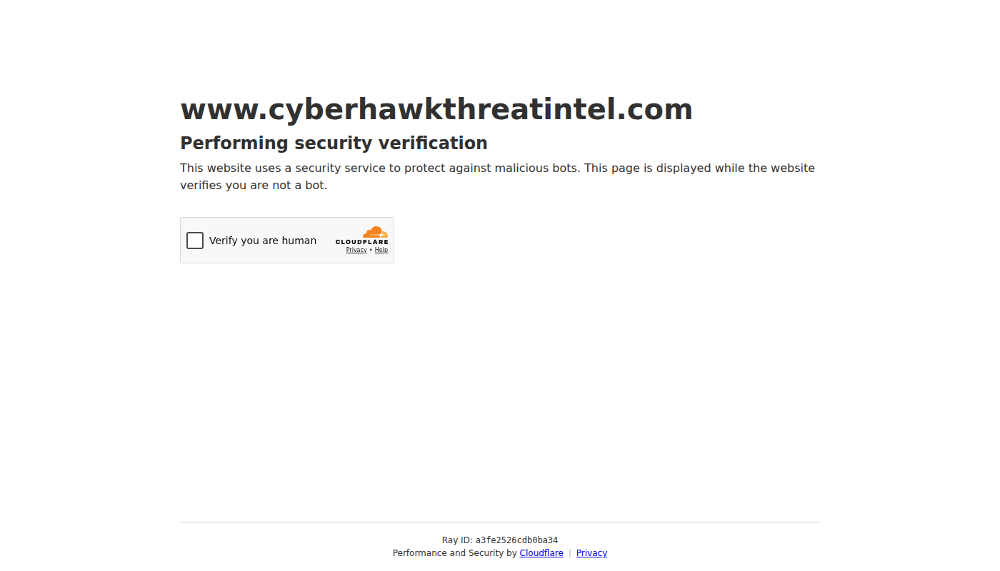

<h1>

</h1>

&nbsp;

&nbsp;

---

 

&nbsp;

 

---

---

## 🚀 Featured Projects

  

  

---

## 🌐 Connect

  

---

## 🖥️ CyberHawk Threat Intel — Live

 

 

<i>Screenshot auto-refreshed daily · Authorized security research & penetration testing only. Unauthorized use is illegal.</i>

